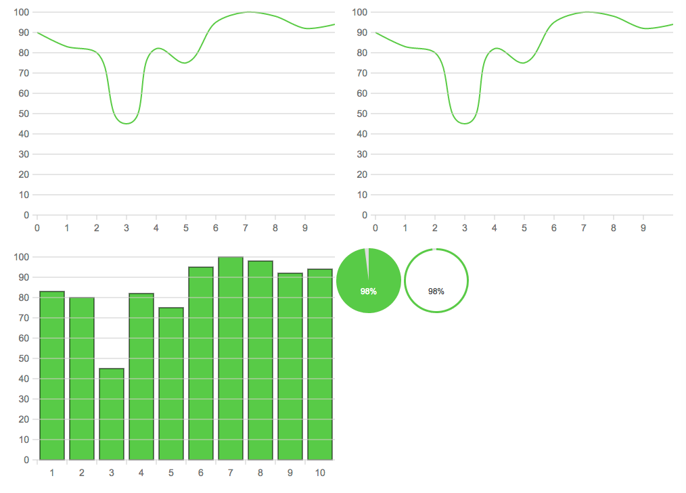

# react-raphael-chart

so easy, create charts with react-raphael!

## Install

	npm install --save react-raphael-chart

## API

#### PieChart

**All props**

- color `string` arc fill color of PieChart
- background `string` background fill color of PieChart
- radius `number` radius of PieChart's circle
- center `object` radius of PieChart's circle
- label `number` text of PieChart's label
- fontsize `object` fontsize of PieChart's label
- total `string` total of PieChart's data
- value `number` value of PieChart's data
- width `number` width of PieChart
- height `number` width of PieChart
- style `object` style of PieChart's container
- className `string` className of PieChart's container

#### DoughnutChart

**All props**

- color `string` arc fill color of DoughnutChart
- background `string` background fill color of DoughnutChart
- radius `number` radius of DoughnutChart's circle
- center `object` radius of DoughnutChart's circle
- thinckness `number` thinckness of DoughnutChart's circle
- label `number` text of DoughnutChart's label
- fontsize `object` fontsize of DoughnutChart's label
- total `string` total of DoughnutChart's data
- value `number` value of DoughnutChart's data
- width `number` width of DoughnutChart
- height `number` width of DoughnutChart
- style `object` style of DoughnutChart's container
- className `string` className of DoughnutChart's container

## Develop

1. clone the repository

        git clone https://github.com/liuhong1happy/react-raphael-chart.git
    
2. install dependency package;

        npm install 

3. run example

        npm run example
        
4. build

        npm run build
        
## Use

Now , you can see [example](example/index.js) !

## Snapshot

# Contact

Email: [liuhong1.happy@163.com](mailto:liuhong1.happy@163.com)
